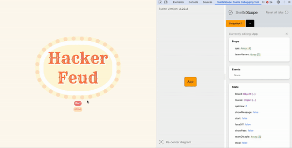
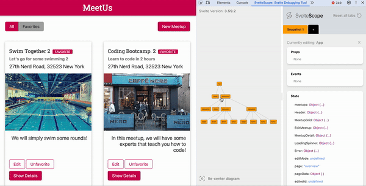

<p align="center">
  <svg class="logo-svg" xmlns="http://www.w3.org/2000/svg" width="100" height="100" viewBox="0 0 48 48">
    <path fill="none" stroke="currentColor" stroke-linecap="round" stroke-linejoin="round" d="m28.072 17.405l7.05-10.424c.584-.864-.168-2.002-1.192-1.805L15.308 8.773L7.993 19.589a2.352 2.352 0 0 0 .63 3.266l10.817 7.314l21.397-4.132l-8.633 12.765l-18.622 3.596c-1.024.198-1.776-.941-1.192-1.805l7.05-10.424l8.632-12.764l12.765 8.632" />
  </svg>
</p>
<h1 align="center"><a href="https://www.sveltescope.com" style="font-size: 36px;">SvelteScope</a></h1>


SvelteScope is a Google Chrome Extension specifically designed for Svelte webpages, offering developers a platform to test webpage behaviors and conduct component experimentation within the browser environment. Its features include an interactive visual tree diagram, real-time rendering of state changes, and the ability for developers to create multiple snapshots, all aimed at streamlining front-end testing processes.

## Key Features

SvelteScope provides developers with an interactive tree diagram to explore component relationships, streamlining the comprehension of the application's structure. Additionally, developers can click on individual components to navigate their properties, state, and events.

<p align="center">
  
</p>


Generate test data scenarios by adjusting component props directly on the SvelteScope app and observe immediate rendering updates directly within the webpage.

<p align="center">
  
</p>


Front-end testing often involves extensive trials to pinpoint the source of issues. To facilitate tracking and comparison of tests, SvelteScope offers developers the ability to create multiple snapshots. Within SvelteScope, developers can organize these snapshots into tabs, enabling easy addition and removal as needed.

<p align="center">
  
</p>

<div style="margin-bottom: 40px;"></div>

## Installation and Usage Guide for SvelteScope

To install the SvelteScope developer tool onto Chrome browser, please visit Chrome Web Store. 

<a href="https://chromewebstore.google.com/">
	<picture>
		<source media="(prefers-color-scheme: dark)" srcset="https://storage.googleapis.com/web-dev-uploads/image/WlD8wC6g8khYWPJUsQceQkhXSlv1/UV4C4ybeBTsZt43U4xis.png">
		
	</picture>
</a>

(Developer: If you're interested in contributing to this project, please refer to the Contribution section below for instructions)


If you haven't already, enable the extension by following these steps:
1. Click on the three dots (⋮) located at the top right corner of the browser window to open the Chrome menu.		
2. From the menu, select "More tools," then choose "Extensions." This will open the Extensions page.
3. Locate the extension you want to enable in the list of installed extensions.
4. Toggle the switch next to the extension to the right (gray to blue) to enable it.


**Usuage Guidelines**

SvelteScope only functions on locally hosted Svelte web pages.
* Access the developer tools by right-clicking anywhere on the webpage and selecting "Inspect" from the context menu.
* Locate and click on 'SvelteScope' in the top ribbon of the developer tools.
* Explore webpages to observe the real-time rendering of a visual tree component for the Svelte App.
* Select components in the visual tree diagram to access their states.
* Modify component props, events, and states using the editor box, and observe live changes on the webpage.
* Generate additional snapshots by clicking the "+" icon. Delete snapshots by clicking the "x" icon. Reset all tabs by clicking "reset".


<div style="margin-bottom: 40px;"></div>

<h1 ><a  href="https://github.com/oslabs-beta/Sveltune" >Open Source Contribution</a></h1>

We greatly encourage contributions from the community. Your input, suggestions, and feedback play a crucial role in advancing the project. Below are ways in which you can contribute:

- Review our code and provide feedback.
- Test the extension and report any bugs or issues you encounter.
- Suggest new features or improvements.
- Submit pull requests to address open issues or implement new features.

Instructions to download repository.

1. Access the SvelteScope GitHub repository. 
2. Fork the repository to create personal working of the repository.
3. Clone or download the the fork to your local machine.
4. Install the dependencies
``` npm install ```
5. Once the dependencies are installed, run the following command to build the Svelte extension to compile the code.
``` npm run build ```
6. Save all changes.
7. Open Chrome and go to chrome://extensions/.
7. Enable developer mode by toggling the switch in the top right corner.
8. Click on "Load unpacked" in the top left corner.
9. Navigate to the directory where your local repository is located and select the build folder to load.

## Contributors
- Branden Basche • [LinkedIn](https://www.linkedin.com/in/brandenbasche/) • [Github](https://github.com/brandenrbasche)
- James Lee • [LinkedIn](https://www.linkedin.com/in/james-lee-a7b2842b6/) • [Github](https://github.com/alphajames258)
- Binh Nguyen • [LinkedIn](https://www.linkedin.com/in/binh-nguyen-a07731101/) • [Github](https://github.com/binhnguyen96/)
- Gregory Valentin • [LinkedIn](https://www.linkedin.com/in/gregory-valentin-a389b3221/) • [Github](https://github.com/punkygreg)
- Donald Wong  • [LinkedIn](https://www.linkedin.com/in/donald-wong-93702931) • [Github](https://github.com/dwong92)
